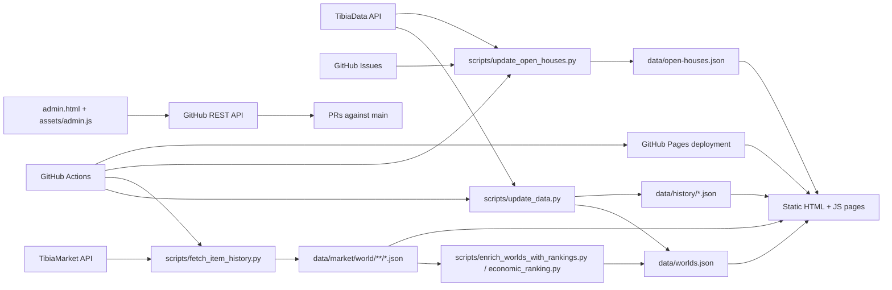

# Tibia Warzones Schedule

Tibia Warzones Schedule is a static GitHub Pages application for tracking Bigfoot's Burden warzone activity across Tibia worlds. It combines inferred service detection from boss-kill statistics, manually curated world schedules, market-based expected-return scoring, and a community-maintained open-house registry into a single browser-accessible tool for players and maintainers.

## Documentation Map

- [Repository documentation hub](./docs/README.md)
- [Architecture overview](./docs/architecture.md)
- [Data maintenance guide](./docs/data-maintenance.md)
- [Expected return methodology](./Expected_Return_Explanation.md)
- [Repository audit](./docs/repository-audit.md)
- [Modernization plan](./docs/modernization-plan.md)

## Purpose Of The Application

The application exists to answer three practical questions for Tibia players and community organizers:

1. Which worlds are currently running Bigfoot's Burden warzone services?
2. When do those services usually happen, in my timezone?
3. Which worlds currently look strongest when service reliability and local market value are taken into account?

Its primary objectives are:

- centralize world-level warzone schedule information in one static site
- expose recent operating status using TibiaData kill statistics
- help players plan runs across multiple worlds with timezone-aware scheduling
- surface economic differences between worlds through a repeatable expected-return model
- keep maintenance lightweight by using committed JSON data, browser tooling, and GitHub Actions instead of a backend

## User Personas

### Players Planning Daily Runs

Needs:

- fast access to current schedules
- timezone conversion
- quick filtering by region, PvP type, transfer type, and BattlEye status

How this documentation serves them:

- clear overview of the homepage, world pages, and ranking page
- no-install usage instructions
- troubleshooting for browser and timezone issues

### Guild Leaders And Service Organizers

Needs:

- a shared planning view across multiple worlds
- a printable or copyable schedule list
- confidence that displayed data reflects recent activity

How this documentation serves them:

- explanation of service inference and manual schedule sources
- examples of planner workflows
- benchmark and data freshness notes

### Repository Maintainers

Needs:

- safe update workflows
- clear distinction between source files and generated files
- low-friction PR creation and validation

How this documentation serves them:

- installation and validation steps
- script inventory and dependency notes
- security guidance for GitHub tokens and GitHub Actions

### Community Contributors

Needs:

- a low-barrier way to submit open houses or corrections
- clarity on what is maintained manually versus automatically

How this documentation serves them:

- support and issue-template links
- FAQ coverage
- explanations of the open-house maintenance workflow

## Key Features

### Core Player Features

- World overview dashboard with search, summary cards, and filters.
- Timezone-aware warzone planner that converts schedules into the viewer's preferred timezone.
- Multi-world schedule selection with copy and print-list output.
- Optional audio notifications for upcoming warzones.
- Multilingual interface with English, Portuguese (Brazil), Spanish (LatAm), and Polish options.

### World Intelligence Features

- Per-world history pages with current mark, detected boss kills, schedule metadata, and recent service history.
- Economic ranking based on local Tibia Coins pricing and reward-value normalization.
- Current-mark classification (`healthy`, `inconclusive`, `trolls`, `na`) driven by boss-kill parity logic.

### Community And Maintainer Features

- Open Houses page backed by GitHub issue submissions and TibiaData house resolution.
- Browser-based maintainer editor at `admin.html` for:
  - warzone schedules
  - tracked market items
  - open-house records
- Browser-based PR creation workflow using the GitHub REST API.
- Fully static deployment model with GitHub Pages and GitHub Actions automation.

### Unique Selling Points

- no backend, database, or application server to maintain
- committed JSON datasets make the site inspectable and easy to diff
- admin workflow works from the browser without leaving the static site
- ranking model is transparent and documented in-repo

## User Interface Overview

The site is a multi-page static application with shared navigation and shared visual language.

### Main Navigation

The top bar links to:

- `Home` for world discovery and planning
- `Open Houses` for the community registry
- `Ranking` for economic comparison
- `Bigfoot's Burden Quest` for quest reference material
- `Admin` for maintainers only

### Home Page

The home page centers on planning:

- world search
- timezone selector
- filter bar
- selected-schedule planner
- world summary cards

User experience considerations:

- planner data updates live as worlds are selected
- copy/print output supports external coordination
- filters persist through browser storage
- the schedule view is responsive and intended for desktop and mobile

### World Page

Each world page focuses on detail:

- summary metadata
- current service mark
- detected boss kills
- manual schedule
- market prices
- recent history

### Ranking Page

The ranking page emphasizes comparison:

- searchable ranking table
- filters by world attributes and current mark
- explanation of the ranking methodology

### Open Houses Page

The open-houses experience mirrors the world overview model:

- searchable world cards
- world detail view
- utility metadata such as mailbox, shrines, dummies, and hirelings

### Admin Page

The admin page is explicitly for maintainers and provides:

- GitHub token testing
- schedule editing
- tracked-item editing
- open-house editing
- change review
- branch creation, commit creation, and pull-request opening

## Application Architecture



## Repository Structure

```text
tibia-warzones-schedule/
├─ .github/                 issue templates and GitHub Actions workflows
├─ assets/                  shared frontend JavaScript, CSS, images, and sounds
├─ data/                    source inputs plus generated JSON datasets
├─ docs/                    architecture, maintenance, audit, and roadmap docs
├─ logs/                    retained maintenance logs
├─ scripts/                 Python refresh, ranking, and validation utilities
├─ tests/                   unittest coverage for helper and validation logic
├─ admin.html               maintainer browser editor
├─ index.html               home page and planner
├─ open-houses.html         open-house registry UI
├─ ranking.html             expected-return ranking UI
├─ world.html               per-world detail UI
├─ bigfoot.html             quest reference page
├─ Expected_Return_Explanation.md
├─ README.md
└─ LICENSE
```

For directory-specific notes, see:

- [assets/README.md](./assets/README.md)
- [docs/README.md](./docs/README.md)
- [data/README.md](./data/README.md)
- [scripts/README.md](./scripts/README.md)

## Installation Instructions

### End Users

No installation is required to use the published site. The application is designed to run as static HTML, CSS, JavaScript, and JSON served from GitHub Pages.

### Local Preview Prerequisites

- Python 3.12 recommended
- Git
- modern browser
- internet access if you want to refresh upstream data

Optional maintainer tooling:

- Node.js 20 for local JavaScript syntax validation
- a GitHub fine-grained personal access token for `admin.html`

### macOS And Linux

```bash
git clone https://github.com/nesleykent/tibia-warzones-schedule.git
cd tibia-warzones-schedule
python3 -m venv .venv
source .venv/bin/activate
python3 -m pip install -r requirements.txt
python3 -m http.server 4173
```

Open:

```text
http://127.0.0.1:4173/
```

### Windows PowerShell

```powershell
git clone https://github.com/nesleykent/tibia-warzones-schedule.git
cd tibia-warzones-schedule
py -3 -m venv .venv
.\.venv\Scripts\Activate.ps1
py -3 -m pip install -r requirements.txt
py -3 -m http.server 4173
```

Open:

```text
http://127.0.0.1:4173/
```

### Maintainer Data Refresh Commands

Refresh worlds and history:

```bash
python3 scripts/update_data.py
```

Refresh tracked market history:

```bash
python3 scripts/fetch_item_history.py
```

Rebuild rankings from existing market files:

```bash
python3 scripts/enrich_worlds_with_rankings.py
```

Rebuild open houses:

```bash
python3 scripts/update_open_houses.py
```

### Validation Before Pushing

```bash
python3 -m py_compile scripts/*.py
python3 -m unittest discover -s tests -v
python3 scripts/validate_content.py
node --check assets/*.js
```

## Technical Requirements And Dependencies

### Runtime Requirements

- modern browser with JavaScript enabled
- support for `fetch`, `localStorage`, and `sessionStorage`
- optional support for notifications and audio playback for planner alerts

### Development And Maintenance Requirements

- Python 3.12 in CI and recommended locally
- Node.js 20 in CI for syntax validation only
- `numpy` for `scripts/remove_outliers.py`
- GitHub Actions for scheduled refresh and deployment workflows

### External Dependencies

- [TibiaData API](https://docs.tibiadata.com/) for worlds, kill statistics, character data, and house data
- TibiaMarket item history endpoint for market snapshots
- GitHub REST API for maintainer PR creation and issue-based open-house workflows

### Architectural Constraints

- no Node package manifest
- no bundler
- no server-side rendering
- no database
- no authenticated application backend

## Usage Guidelines

### Common Task: Find Worlds Running Warzones Today

1. Open `index.html`.
2. Search for a world or filter by region, PvP type, transfer type, or BattlEye status.
3. Review each card's mark and service count.

### Common Task: Build A Personal Planner

1. On `index.html`, select one or more worlds from the world cards.
2. Choose your preferred timezone from the selector.
3. Review the planner panel for converted times.
4. Use `Print List` or `Copy` to export the visible schedule.

### Common Task: Inspect One World In Detail

Open a world page directly, for example:

```text
world.html?name=Antica
```

Use the world page to inspect:

- current mark
- detected daily boss kills
- manual schedule
- recent history
- market data and expected-return fields

### Common Task: Review Market Ranking

1. Open `ranking.html`.
2. Search or filter the table.
3. Use the methodology link to understand the expected-return calculation.

### Common Task: Submit Or Correct An Open House

- New reports: use the GitHub issue template for open-house submissions.
- Corrections or removals: use the maintenance issue template.

The open-house update workflow resolves the report, rebuilds `data/open-houses.json`, comments on accepted issues, and closes them when appropriate.

### Common Task: Edit Data As A Maintainer

1. Open `admin.html`.
2. Paste a fine-grained GitHub personal access token.
3. Test the connection.
4. Edit schedules, tracked items, or open houses.
5. Review pending file changes.
6. Create a branch, commit changes, and open a pull request.

## Security Considerations

### Browser And Token Safety

- The public site is static and does not store server-side user data.
- `admin.html` uses the GitHub REST API directly from the browser.
- Token persistence is opt-in and limited to `sessionStorage` for the current browser tab.
- Maintainers should use fine-grained GitHub tokens scoped only to this repository.

Recommended PAT scopes for the admin page:

- `Contents: Read and write`
- `Pull requests: Read and write`

### Workflow Secrets

GitHub Actions refresh jobs rely on `OPEN_HOUSE_GITHUB_TOKEN` for authenticated repository writes and issue management.

### Data Trust And Validation

- community-maintained schedules and open-house data should be validated before merge
- `scripts/validate_content.py` exists to prevent malformed source or generated data from landing in `main`
- the ranking model depends on external market and TibiaData inputs, so missing upstream data can legitimately reduce ranking coverage

### Operational Guidance

- prefer setting `TIBIA_MARKET_TOKEN` explicitly for market refreshes instead of relying on any bundled fallback token behavior
- do not reuse broad GitHub tokens in the browser editor
- treat issue-submitted content as untrusted input until validated

## Performance Metrics And Operational Benchmarks

Snapshot date: `2026-06-04`

### Data Scale

- 93 world records in `data/worlds.json`
- 55 worlds with manual schedules
- 63 worlds currently tracking warzone service activity
- 61 ranked worlds with `is_ranked = true`
- 93 per-world history files
- 30 open-house records
- 720 market history files across 90 world directories

### Dataset Footprint

- `data/worlds.json`: 431,642 bytes
- `data/open-houses.json`: 45,798 bytes
- `data/history/`: 1,050,115 bytes total
- `data/market/world/`: 122,697,664 bytes total

### Local Validation Benchmarks

- 27 automated unit tests passed locally in `0.005s`
- `python3 -m py_compile scripts/*.py` passed
- `python3 scripts/validate_content.py` passed with warnings only

Current expected validation warnings:

- missing market coverage for `Floribra`
- missing market coverage for `Junera`
- missing market coverage for `Maligna`

These warnings are documented exceptions rather than current breakages.

## Troubleshooting

### The Site Looks Empty Or Fails To Load JSON Locally

Cause:

- opening the HTML files directly with `file://` instead of serving them over HTTP

Fix:

- run `python3 -m http.server 4173`
- open `http://127.0.0.1:4173/`

### A World Has No Ranking Position

Cause:

- the world may be marked `na`
- the world may have insufficient history or market inputs
- the world may be intentionally excluded from ranking

Fix:

- inspect `warzone_economic_ranking` in `data/worlds.json`
- verify tracked market files exist for that world
- rerun `scripts/fetch_item_history.py` and `scripts/enrich_worlds_with_rankings.py`

### Open-House Sync Fails

Cause:

- missing `GITHUB_TOKEN`
- missing `GITHUB_REPOSITORY`
- network or upstream API failure

Fix:

- export the required environment variables
- confirm the issue uses the expected title and body template
- rerun `python3 scripts/update_open_houses.py`

### The Admin Page Cannot Create A Pull Request

Cause:

- invalid token
- missing repository permissions
- failed connection test

Fix:

- create a fine-grained token with repository-scoped `Contents` and `Pull requests` access
- retest the connection in `admin.html`
- clear the token and retry if stale session data is present

### Market Refresh Is Slow Or Rate-Limited

Cause:

- the market job is intentionally conservative and fetches many per-world item histories

Fix:

- use `--max-requests` or `--max-runtime-seconds` for controlled local runs
- rerun later if the external service rate-limits requests
- set `TIBIA_MARKET_TOKEN` explicitly when appropriate

## Frequently Asked Questions

### Is This An Official Tibia Product?

No. This repository is an independent community project and is not affiliated with or endorsed by CipSoft GmbH.

### Does The App Need A Backend?

No. The deployed application is a static site. All rendered data comes from committed JSON files.

### How Are Warzone Services Detected?

The project infers activity from TibiaData kill statistics for Deathstrike, Gnomevil, and Abyssador, then combines that signal with manually maintained schedules.

### Why Do Some Worlds Show `na`, `trolls`, Or `inconclusive`?

Those marks come from the relationship between the three tracked boss-kill counts. Equal non-zero kills indicate `healthy`; mismatched patterns can indicate `trolls` or `inconclusive`; all-zero activity becomes `na`.

### What Does `ER` Mean?

`ER` means expected return. On the ranking page it is normalized into Tibia Coins. See [Expected return methodology](./Expected_Return_Explanation.md).

### Can I Contribute Without Running Python Locally?

Yes. Open-house submissions can be filed through GitHub issues, and maintainers can use `admin.html` to prepare pull requests from the browser.

### Which Languages Does The UI Support?

English, Portuguese (Brazil), Spanish (LatAm), and Polish.

## Similar Or Adjacent Documentation References

These are documentation-style references rather than one-to-one feature matches:

- [TibiaData Documentation](https://docs.tibiadata.com/): strong example of domain-specific API reference documentation.
- [GitHub Pages documentation](https://docs.github.com/en/pages/getting-started-with-github-pages/about-github-pages?ref=lime-link): clear hosting and deployment reference structure for static sites.
- [Open Innovations dashboard README](https://github.com/open-innovations/dashboard): concise README style for a static, data-driven dashboard.

## Future Updates

Current planned or recommended next phases, based on the in-repo modernization plan:

- split oversized frontend files such as `assets/app.js`, `assets/world.js`, `assets/admin.js`, and `assets/styles.css`
- normalize the internal `data/worlds.json` contract while preserving compatibility
- add correction and override layers for world metadata and historical exceptions
- expand integration tests around the data-refresh pipeline
- reassess TypeScript and Vite only after frontend modularization reduces migration risk

## Licensing And Legal Disclaimers

- Code and repository documentation are distributed under the [MIT License](./LICENSE).
- Tibia is a registered trademark of CipSoft GmbH.
- This project is independent and is not affiliated with, sponsored by, or endorsed by CipSoft GmbH, Tibia.com, TibiaData, TibiaMarket, or related services.
- Community-maintained data can contain mistakes. Users should verify schedules, house ownership, and market assumptions when accuracy matters.
- The software is provided `as is`, without warranty of any kind.

## Contact And Support

- GitHub repository: <https://github.com/nesleykent/tibia-warzones-schedule>
- General issues and support: <https://github.com/nesleykent/tibia-warzones-schedule/issues>
- Open-house submission template: [`.github/ISSUE_TEMPLATE/open-house.yml`](./.github/ISSUE_TEMPLATE/open-house.yml)
- Open-house correction template: [`.github/ISSUE_TEMPLATE/open-house-maintenance.yml`](./.github/ISSUE_TEMPLATE/open-house-maintenance.yml)

For code or maintenance work, start with the [documentation hub](./docs/README.md).
