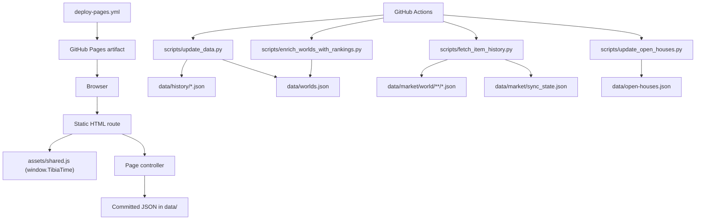

# Repository Architecture Report

Audit date: 2026-06-04  
Audited commit: `e5d2ed3`

## Scope And Evidence

This report was built from:

- source files in the repo root, `assets/`, `scripts/`, `tests/`, and `data/`
- workflow files in `.github/workflows/`
- repository docs in `README.md`, `Expected_Return_Explanation.md`, and `docs/*.md`
- verified command execution on the local checkout

Documentation was treated as evidence to verify, not as authority.

## Repository Discovery Summary

### Verified purpose

The repository publishes a static GitHub Pages application for Tibia warzone planning and world comparison.

Code evidence:

- `assets/app.js`: home page planner, filters, schedule panel, notifications
- `assets/world.js`: per-world summary, market, history, modal interactions
- `assets/ranking.js`: ranking page built from `data/worlds.json`
- `assets/open-houses.js`: open-house overview and per-world detail
- `scripts/update_data.py`: world + history refresh pipeline
- `scripts/economic_ranking.py`: ranking computation
- `scripts/update_open_houses.py`: GitHub-issue-backed open-house registry generation

### Documentation scanned

- `README.md`
- `Expected_Return_Explanation.md`
- `docs/architecture.md`
- `docs/operational-runbook.md`
- `docs/repository-audit.md`
- `docs/ui-ux-audit.md`
- `.github/workflows/*.yml`
- `requirements.txt`

Not found:

- `CONTRIBUTING.md`
- wiki files
- `package.json`
- `Makefile`
- `Dockerfile`
- docker-compose files
- release automation files

## Repository Shape

### Top-level layout

| Path | Role | Evidence |
| --- | --- | --- |
| `index.html`, `world.html`, `ranking.html`, `open-houses.html`, `bigfoot.html`, `admin.html` | Static route entry points | root HTML files |
| `assets/` | Shared stylesheet, page controllers, media assets | `assets/styles.css`, `assets/*.js` |
| `data/` | Committed source inputs and generated public datasets | `data/worlds.json`, `data/history/`, `data/market/`, `data/manual-schedules.json`, `data/open-houses.json` |
| `scripts/` | Refresh, ranking, validation, and maintenance utilities | `scripts/*.py` |
| `tests/` | Python `unittest` coverage | `tests/test_script_helpers.py`, `tests/test_validate_content.py` |
| `.github/workflows/` | Deployment and data-refresh automation | workflow YAML files |

### Quantitative footprint

Verified on the local checkout:

- `data/market`: `119M`
- `data/history`: `1.1M`
- `assets/background`: `9.6M`
- `data/worlds.json`: `423243` bytes
- `assets/styles.css`: `81885` bytes
- `assets/app.js`: `70592` bytes
- `assets/world.js`: `63600` bytes
- `assets/admin.js`: `61491` bytes
- `93` worlds in `data/worlds.json`
- `63` worlds with detected activity
- `55` worlds with manual schedules
- `61` ranked worlds
- `30` open-house records
- `90` market world directories
- `720` market JSON files

## Runtime Architecture



### Frontend composition

All page controllers consume a shared global runtime from `assets/shared.js`.

Evidence:

- `assets/app.js:5-36`
- `assets/ranking.js:1-21`
- `assets/open-houses.js:1-14`
- `assets/admin.js:1-27`

There is no module bundler or import graph for browser code. Every page loads:

- `assets/styles.css`
- `assets/shared.js`
- one page-specific controller

Evidence:

- `index.html:178-179`
- `ranking.html:109-110`
- `world.html:153-154`
- `open-houses.html:137-138`
- `admin.html:242-243`
- `bigfoot.html` loads only `assets/shared.js` and `assets/bigfoot.js`

### Major frontend modules

| Module | Responsibility | Evidence |
| --- | --- | --- |
| `assets/styles.css` | shared theme, layout, component styles, responsive navigation, and interaction-size tokens | `:root`, `--interactive-target-min`, `.topbar-links`, `.filter-pill` |
| `assets/shared.js` | storage helpers, timezone helpers, accessible navigation and language-menu wiring, document metadata, footer rendering, shared labels, filter-control markup, and delegated surface navigation | `getInitialLanguage()`, `setDocumentLanguage()`, `getCenteredNavigationScrollLeft()`, `getMenuNavigationIndex()`, `activateSurfacePrimaryLink()`, `readStorage()`, `renderSiteFooter()`, `renderFilterPill()`, `initLanguageDropdown()` |
| `assets/app.js` | world overview, filters, planner, print-list modal, notifications | `renderWorld()`, `renderSchedulePanel()`, `openPrintListModal()` |
| `assets/world.js` | per-world summary, market cards, history, market modal | `loadWorldPage()`, `renderMarketPrices()`, `openMarketItemModal()` |
| `assets/ranking.js` | ranking filters, summary, ranking table | `render()`, `renderTable()` |
| `assets/open-houses.js` | world list/detail routing and filters for open houses | `render()`, `getVisibleWorlds()`, `renderRouteState()` |
| `assets/admin.js` | maintainer editor and browser-driven GitHub direct-commit flow | `init()`, `buildPendingReview()`, `commitSourceFilesToMain()` |
| `assets/bigfoot.js` | shared UI initialization only | file contents |

## Data Model And Data Flows

### Durable source inputs

| File | Durable role | Evidence |
| --- | --- | --- |
| `data/manual-schedules.json` | maintainer-edited schedule source | `scripts/update_data.py:26`, `136-154` |
| `data/market/items/items.csv` | tracked item catalog | `scripts/common.py:14`, `195-255` |
| `data/market/items/tracked_items.json` | tracked item allowlist | `scripts/common.py:15-18`, `177-184` |
| GitHub issues matching open-house templates | durable open-house input | `scripts/update_open_houses.py:25-26`, `336-392`; `.github/ISSUE_TEMPLATE/*.yml` |

### Generated outputs

| File | Producer | Consumer |
| --- | --- | --- |
| `data/worlds.json` | `scripts/update_data.py`, `scripts/enrich_worlds_with_rankings.py` | `assets/app.js`, `assets/world.js`, `assets/ranking.js`, `assets/open-houses.js`, `assets/admin.js` |
| `data/history/*.json` | `scripts/update_data.py` | `assets/world.js`, `scripts/economic_ranking.py` |
| `data/market/world/**/*.json` | `scripts/fetch_item_history.py` | `assets/world.js`, `scripts/economic_ranking.py` |
| `data/market/sync_state.json` | `scripts/fetch_item_history.py` | same script on next run |
| `data/open-houses.json` | `scripts/update_open_houses.py` | `assets/open-houses.js`, `assets/admin.js` as read-only input |

### Pipeline 1: worlds and history

Flow:

1. `scripts/update_data.py:get_worlds()` fetches the world catalog from TibiaData.
2. `scripts/update_data.py:get_kill_statistics()` fetches per-world kill statistics from TibiaData.
3. `scripts/update_data.py:load_manual_schedules()` merges `data/manual-schedules.json`.
4. `scripts/update_data.py:update_world_history()` rewrites `data/history/<world>.json`.
5. `scripts/update_data.py:build_world_summary()` creates the current world record.
6. `scripts/economic_ranking.py:attach_ranking_metrics()` embeds `warzone_economic_ranking`.
7. `scripts/update_data.py:save_json()` writes `data/worlds.json`.

### Pipeline 2: market refresh and ranking enrichment

Flow:

1. `scripts/common.py:get_tracked_worlds()` resolves tracked worlds, preferring `data/worlds.json`.
2. `scripts/common.py:discover_tracked_items()` resolves tracked items from `items.csv` and `tracked_items.json`.
3. `scripts/fetch_item_history.py:run()` fetches TibiaMarket history and writes one JSON file per world/item pair.
4. `scripts/fetch_item_history.py:write_sync_checkpoint()` records progress in `data/market/sync_state.json`.
5. `scripts/enrich_worlds_with_rankings.py:main()` rewrites `data/worlds.json` from the local market/history data.

### Pipeline 3: open-house registry

Flow:

1. `scripts/update_open_houses.py:fetch_all_issues()` paginates GitHub issues.
2. `scripts/update_open_houses.py:iter_matching_issues()` filters issues by title prefix.
3. `scripts/update_open_houses.py:build_record_from_issue()` parses issue bodies and resolves TibiaData house/character metadata.
4. `scripts/update_open_houses.py:apply_maintenance_issue()` edits or removes existing records.
5. `scripts/update_open_houses.py:build_registry()` normalizes the registry and aborts with issue-scoped errors on failure.
6. `scripts/update_open_houses.py:save_json()` writes `data/open-houses.json`.

## External Services

| Service | Use | Evidence |
| --- | --- | --- |
| TibiaData | world list, kill stats, character lookup, house lookup | `scripts/update_data.py:21`, `47-59`; `scripts/update_open_houses.py:19`, `169-211` |
| TibiaMarket | item history | `scripts/fetch_item_history.py:28`, `146-155`, `484-698` |
| GitHub REST API | issue ingestion and browser-based maintainer direct-commit flow | `scripts/update_open_houses.py:20-23`, `93-105`; `assets/admin.js:14-27`, `1533-1590` |
| GitHub Pages | static site hosting | `.github/workflows/deploy-pages.yml:63-89` |

## Build, Test, Deployment, And CI/CD

### Build system

No application build system was found.

Evidence:

- no `package.json`
- no `Makefile`
- no Docker files
- Pages deploy copies committed files directly instead of building them: `.github/workflows/deploy-pages.yml:63-67`

### Test and validation system

Verified commands:

```bash
python3 -m py_compile scripts/*.py tests/*.py
python3 -m unittest discover -s tests -v
python3 scripts/validate_content.py
node --check assets/*.js
node --test tests/*.mjs
```

Observed behavior:

- `py_compile` passed.
- `unittest` passed with 48 tests.
- `validate_content.py` passed with warnings for three known missing market worlds.
- `node --check` passed.
- Node's test runner passed with 34 tests.

### Local development workflow

There is no build step. Local preview serves the repository root directly:

```bash
python3 -m http.server 4173
```

### Deployment process

`deploy-pages.yml` runs on:

- `push` to `main`
- `workflow_dispatch`
- a twice-daily schedule

Deploy steps:

1. Python syntax validation
2. unit tests
3. content validation
4. JavaScript syntax validation
5. copy `assets`, `data`, route HTML files, `LICENSE`, and `README.md` into `_site`
6. publish `_site` with GitHub Pages

Important operational fact:

Deployment does not refresh data. It publishes whatever is already committed on `main`.

### Data-refresh automation

| Workflow | Trigger | Effect |
| --- | --- | --- |
| `.github/workflows/update-worlds.yml` | `workflow_dispatch`, `push` to `main` on selected paths, schedule | runs `scripts/update_data.py`, validates, commits `data/worlds.json` and `data/history/` back to `main` |
| `.github/workflows/update-market.yml` | `workflow_dispatch`, `push` to `main` on selected paths, schedule | runs `scripts/fetch_item_history.py`, `scripts/enrich_worlds_with_rankings.py`, validates, commits `data/market/` and `data/worlds.json` |
| `.github/workflows/update-open-houses.yml` | `workflow_dispatch`, issue events | runs `scripts/update_open_houses.py`, validates, commits `data/open-houses.json`, comments on and closes accepted issues |

### Pull request validation

No workflow is triggered by `pull_request`.

Evidence:

- `.github/workflows/` scan shows only `push`, `workflow_dispatch`, `schedule`, and `issues` triggers
- `rg -n "pull_request" .github/workflows` returned no matches

Effect:

Pull requests are not GitHub Actions-gated before merge by repository-owned CI.

## Verified Development Workflow Analysis

### Commands that worked as documented

```bash
python3 -m py_compile scripts/*.py tests/*.py
python3 -m unittest discover -s tests -v
python3 scripts/validate_content.py
node --check assets/*.js
python3 scripts/enrich_worlds_with_rankings.py
```

### Commands that worked only in a prepared environment

`scripts/remove_outliers.py` requires `numpy`.

Evidence:

- `python3 scripts/remove_outliers.py` failed with `ModuleNotFoundError: No module named 'numpy'`
- `.venv/bin/python -m pip install -r requirements.txt` reported `numpy 2.4.4`
- `.venv/bin/python scripts/remove_outliers.py` ran successfully in dry-run mode

### Commands that require network or secrets

| Command | Verified result |
| --- | --- |
| `python3 scripts/update_data.py` | failed in this environment because TibiaData DNS resolution was unavailable |
| `python3 scripts/fetch_item_history.py --world Antica --item "Tibia Coins" --rate-limit-delay 0 --max-requests 1 --reset-progress` | failed in this environment because TibiaMarket DNS resolution was unavailable |
| `GITHUB_TOKEN=... GITHUB_REPOSITORY=owner/repo python3 scripts/update_open_houses.py` | the script hard-failed without those env vars |

## Coding Patterns And Existing Conventions

### Python conventions

- Scripts are small modules with top-level constants and a `main()` returning an exit code.
- `from __future__ import annotations` is used consistently.
- Function signatures are typed, but type checking is not enforced by toolchain.
- Shared normalization lives in `scripts/common.py`.
- Validation is centralized in `scripts/validate_content.py`.

Evidence:

- `scripts/update_data.py:1-18`, `343-422`
- `scripts/common.py:1-143`
- `scripts/validate_content.py:158-172`

### Frontend conventions

- One controller per route.
- Controllers destructure helpers from `window.TibiaTime`.
- DOM is rendered with string templates and `innerHTML`.
- State is module-scoped mutable data plus `localStorage` or `sessionStorage`.

Evidence:

- `assets/app.js:5-36`
- `assets/ranking.js:1-21`
- `assets/open-houses.js:1-17`
- `assets/admin.js:1-54`, `166-185`

### Data conventions

- World and schedule payloads are normalized and sorted before write.
- Market files use a compact JSON serializer in `scripts/fetch_item_history.py`.
- Other generated JSON files are pretty-printed with trailing newlines.

Evidence:

- `scripts/common.py:51-143`
- `scripts/fetch_item_history.py:300-313`, `641-646`
- `scripts/update_data.py:41-45`
- `scripts/update_open_houses.py:75-77`
- `scripts/enrich_worlds_with_rankings.py:24-26`

## Architectural Strengths

- Very low runtime complexity: static site, no server process, no database.
- Durable public state is committed and diffable in Git.
- Contract validation exists in one dedicated script.
- Shared normalization helpers reduce drift between pipelines.
- Market refresh supports checkpoints and bounded execution.
- Open-house registry is driven from auditable GitHub issues.

## Architectural Weaknesses And Technical Debt

- Public app, generated datasets, and maintainer tooling share one repository and one deployed artifact.
- No `pull_request` CI means pre-merge validation is process-based, not enforced.
- Frontend code is untyped and duplicated across page controllers.
- Existing docs drift from current code in multiple places.
- Deployed artifact includes the full `data/` tree, including large market history files.
- Several workflows write directly back to `main`, which couples automation and production state tightly.

## Security Concerns

- `scripts/fetch_item_history.py:37-41` contains a hardcoded bearer-token fallback.
- `admin.html` is publicly deployed, and `assets/admin.js` accepts a repo-write GitHub token in the browser and stores it in `sessionStorage`.
- The scheduled update workflows share a single repo-write secret name, `OPEN_HOUSE_GITHUB_TOKEN`, across different automation concerns.

## Performance Concerns

- The Pages artifact copies `data/market` (`119M`) directly into the deploy output.
- Browser assets are shipped unbundled and mostly unminified.
- The frontend fetches large committed JSON files directly rather than using a build-time export boundary.
- `assets/styles.css` still imports web fonts through CSS `@import`, which adds render-blocking cost.

See also: `docs/ui-ux-audit.md`

## Documentation Drift Found During This Audit

Verified mismatches between current docs and current code:

- `README.md:91` still says `admin.html` can edit `data/open-houses.json`, but `assets/admin.js:1285-1317` now scopes PR creation to schedules and tracked items only, and `admin.html:184-199` explicitly says browser edits are disabled there.
- `docs/operational-runbook.md:64`, `257` still describes `scripts/update_data.py` as writing fallback `na` records instead of failing the run, but `scripts/update_data.py:395-402` now aborts with exit `1` on any failed world.
- `docs/operational-runbook.md:263-267` and `docs/architecture.md:188` still describe market world discovery as directory-driven, but `scripts/common.py:258-288` now prefers `data/worlds.json` and only falls back to directory scanning.
- `docs/repository-audit.md` still records earlier findings about duplicate fields, admin open-house editing, fallback records, and directory-driven world discovery that are no longer true in current code.

## Summary For Maintainers And Agents

This repository is operationally simple but governance-sensitive. The core risks are not “hard to build” problems; they are:

- weak pre-merge enforcement
- drift between code and docs
- public maintainer tooling that handles sensitive tokens
- large committed datasets deployed directly to production
- heavy dependence on external APIs for refresh workflows

Any agent or human change should preserve the repository’s current strengths:

- stdlib-first automation
- explicit source-of-truth files
- committed generated outputs
- validation-first maintenance
